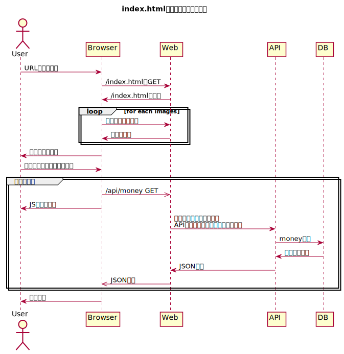

= 04_multi

負荷分散できるようにする。

== コンテナ構成

* proxy (new)
* web
* api
* db

image:img/network.svg[Network]

== 画面描画までのデータの流れ

== アプリの起動

[source,bash]
----
docker-compose build --no-cache
docker-compose up
----

トップページを表示する。

[source,bash]
----
curl http://localhost:8000/
----

APIにリクエストする。

[source,bash]
----
curl http://localhost:8000/api/money
curl http://localhost:8000/api/insert/1234
curl http://localhost:8000/api/delete/1
----

== 作業メモ

あればかく

== 参考

* https://qiita.com/Esfahan/items/91f01368a37abf83cf25[docker-compose + リバースプロキシ + ロードバランシングの環境構築手順]
* https://www.nedia.ne.jp/blog/tech/2016/08/04/7938#Nginx-2[Nginxのロードバランシング機能を使ってみよう！]
