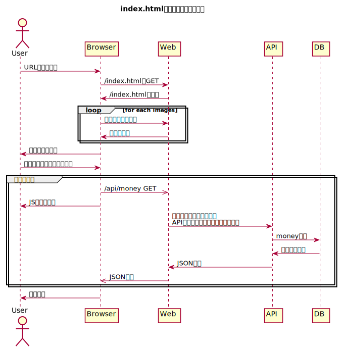

= 04_multi

負荷分散できるようにする。
nginxコンテナからリバースプロキシを使用してWebサーバに負荷分散する。
webコンテナからリバースプロキシを使用してAPIサーバに負荷分散する。

== コンテナ構成

* proxy (new)
* web
* api
* db

== 画面描画までのデータの流れ

== アプリの起動

[source,bash]
----
docker-compose build --no-cache
docker-compose up

# コンテナを複数起動したいときはこっち
docker-compose up --scale web=4 --scale api=2
----

トップページを表示する。

[source,bash]
----
curl http://localhost:8000/
----

APIにリクエストする。

[source,bash]
----
curl http://localhost:8000/api/money
curl http://localhost:8000/api/insert/1234
curl http://localhost:8000/api/delete/1
----

== 作業メモ

=== nginxの設定

`docker run -it nginx bash` でコンテナに入って設定ファイル
(/etc/nginx/conf.d/defautl.conf)を確認した。
この設定を残しつつ/etc/nginx/conf.d/proxy.confを追加するように配置しても設定が反
映されていないように見えた。

default.confが存在すると先にそっちを参照しているのかもしれない。

今回はconf.dをまるごとマウントするようにして、default.confがコンテナ内に残らない
ようにして解決した。

=== scaleするときはcontainer_name設定をYAMLから消す

`docker-compose scale web=4` とかってやればコンテナを複数起動できるみたい。
ただしそれをやるときはコンテナ名を固定する `container_name` という設定をYAMLから
外さないといけない。コンテナ名がコンフリクトしてエラーで起動できない。

== 参考

* https://qiita.com/Esfahan/items/91f01368a37abf83cf25[docker-compose + リバースプロキシ + ロードバランシングの環境構築手順]
* https://www.nedia.ne.jp/blog/tech/2016/08/04/7938#Nginx-2[Nginxのロードバランシング機能を使ってみよう！]
